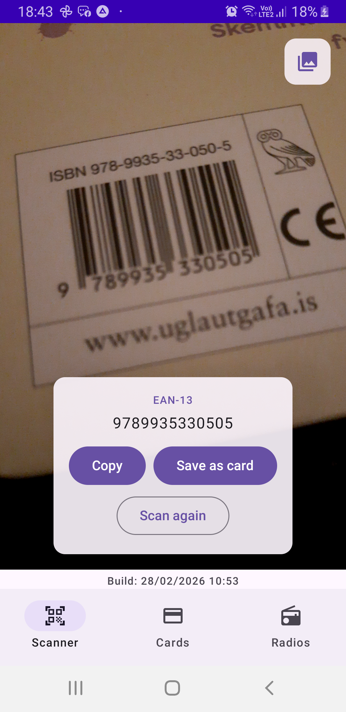
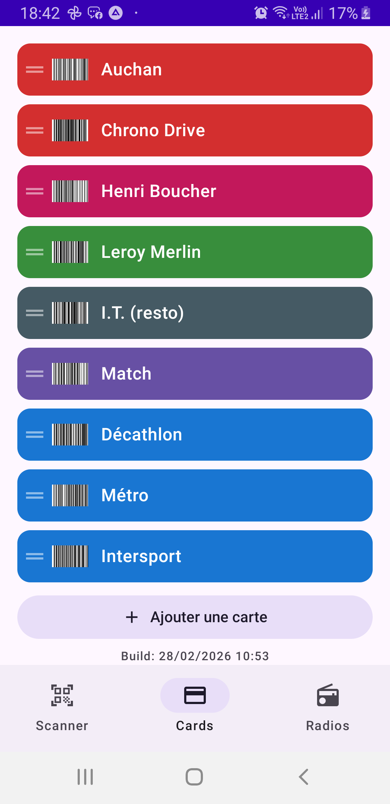
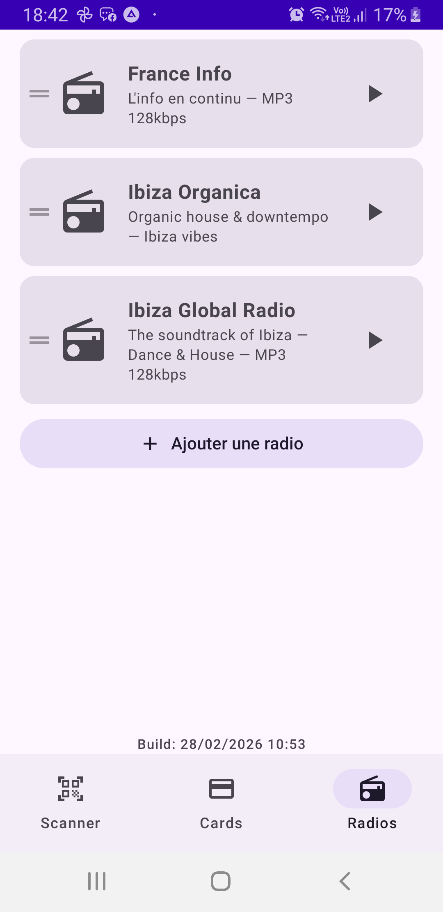

# ManyInOne

Application Android regroupant plusieurs utilitaires du quotidien en une seule app.

## Captures d'écran

| Scanner | Cartes de fidélité | Radio |
|:---:|:---:|:---:|
|  |  |  |

## Fonctionnalités

### Scanner de codes-barres / QR codes
- Détection en temps réel via la caméra (CameraX + ML Kit)
- Import depuis la galerie
- Copie du résultat dans le presse-papier
- Ouverture des URLs directement
- Sauvegarde en carte de fidélité

### Cartes de fidélité
- Stockage et affichage des cartes avec code-barres généré
- Couleurs personnalisables par carte (contraste texte automatique)
- Réorganisation par glisser-déposer
- Persistance via Room (SQLite)

### Radio
- Lecture de flux audio en streaming (Media3 / ExoPlayer)
- Stations par défaut : France Info, Ibiza Orgánica, Ibiza Global Radio
- Ajout / modification / suppression de stations personnalisées
- Réorganisation par glisser-déposer
- Métadonnées ICY (artiste / titre en cours)
- Timer de veille (5 min, 10 min, 15 min, 30 min, 1 h)
- Service de lecture en premier plan

## Stack technique

| Couche | Technologie |
|---|---|
| UI | Jetpack Compose + Material 3 |
| Navigation | AndroidX Navigation Compose |
| Caméra | CameraX |
| Détection codes | ML Kit Barcode Scanning |
| Génération codes | ZXing Core |
| Audio | Media3 (ExoPlayer) |
| Base de données | Room v6 |
| Async | Kotlin Coroutines + Flow |
| Build | Gradle 8 (KTS) + KSP |

## Prérequis

- Android 9+ (API 28)
- Android Studio Hedgehog ou supérieur
- JDK 11

## Lancer le projet

```bash
git clone https://github.com/frtriquet/ManyInOne.git
cd ManyInOne
./gradlew assembleDebug
```

Ou ouvrir directement dans Android Studio et lancer sur un émulateur / appareil.

## Permissions requises

| Permission | Usage |
|---|---|
| `CAMERA` | Scanner les codes-barres |
| `INTERNET` | Streaming radio |
| `FOREGROUND_SERVICE` | Lecture audio en arrière-plan |
| `WAKE_LOCK` | Maintien de la lecture radio |

## Architecture

```
fr.triquet.manyinone/
├── data/local/      # Room DB, entités, DAOs
├── loyalty/         # Cartes de fidélité (Screen, ViewModel)
├── radio/           # Radio (Screen, Service, ViewModel)
├── scanner/         # Scanner (Screen, ViewModel)
├── navigation/      # Routes de navigation
└── ui/              # Composants partagés (drag-drop, thème)
```

Pattern MVVM avec un seul Activity et navigation Compose.

## Licence

Projet personnel — tous droits réservés.
