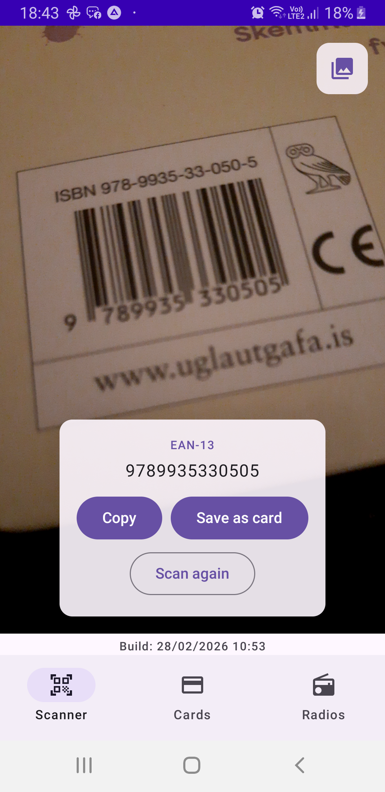
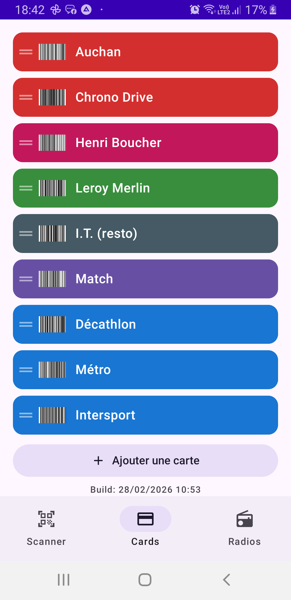
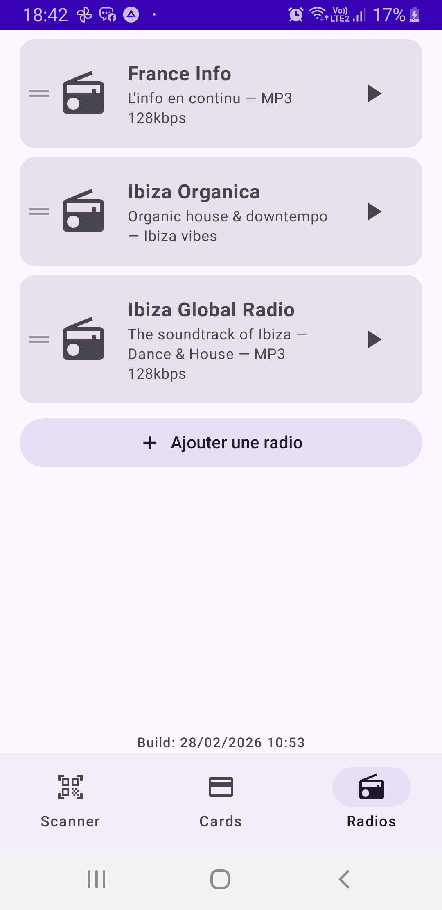

# ManyInOne

[](https://github.com/frederictriquet/ManyInOne/actions/workflows/ci.yml)
[](https://codecov.io/gh/frederictriquet/ManyInOne)
[](https://kotlinlang.org)
[](https://developer.android.com)
[](LICENSE)
[](https://github.com/frederictriquet/ManyInOne/commits/master)
[](https://github.com/frederictriquet/ManyInOne)

Application Android regroupant plusieurs utilitaires du quotidien en une seule app.

## Captures d'écran

| Scanner | Cartes de fidélité | Radio |
|:---:|:---:|:---:|
|  |  |  |

## Fonctionnalités

### Scanner de codes-barres / QR codes
- Détection en temps réel via la caméra (CameraX + ML Kit)
- Import depuis la galerie
- Copie du résultat dans le presse-papier
- Ouverture des URLs directement
- Sauvegarde en carte de fidélité

### Cartes de fidélité
- Stockage et affichage des cartes avec code-barres généré
- Couleurs personnalisables par carte (contraste texte automatique)
- Réorganisation par glisser-déposer
- Persistance via Room (SQLite)

### Radio
- Lecture de flux audio en streaming (Media3 / ExoPlayer)
- Stations par défaut : France Info, Ibiza Orgánica, Ibiza Global Radio
- Ajout / modification / suppression de stations personnalisées
- Réorganisation par glisser-déposer
- Métadonnées ICY (artiste / titre en cours)
- Timer de veille (5 min, 10 min, 15 min, 30 min, 1 h)
- Service de lecture en premier plan

## Stack technique

| Couche | Technologie |
|---|---|
| UI | Jetpack Compose + Material 3 |
| Navigation | AndroidX Navigation Compose |
| Caméra | CameraX |
| Détection codes | ML Kit Barcode Scanning |
| Génération codes | ZXing Core |
| Audio | Media3 (ExoPlayer) |
| Base de données | Room v6 |
| Async | Kotlin Coroutines + Flow |
| Build | Gradle 8 (KTS) + KSP |

## Prérequis

- Android 9+ (API 28)
- Android Studio Hedgehog ou supérieur
- JDK 11

## Lancer le projet

```bash
git clone https://github.com/frtriquet/ManyInOne.git
cd ManyInOne
./gradlew assembleDebug
```

Ou ouvrir directement dans Android Studio et lancer sur un émulateur / appareil.

## Télécharger l'APK

Chaque push sur `master` produit un APK release signé, publié en artifact du run CI :
[Actions → CI → dernier run → *manyinone-release-apk*](https://github.com/frederictriquet/ManyInOne/actions/workflows/ci.yml)
(le téléchargement nécessite d'être connecté à GitHub ; rétention 90 jours).

## Signature de l'APK

### Générer un keystore

```bash
keytool -genkeypair -v -keystore release.jks -keyalg RSA -keysize 2048 \
  -validity 10000 -alias manyinone
```

Conserver `release.jks` hors du dépôt (il est ignoré par `.gitignore`) et le sauvegarder :
sans lui, aucune mise à jour de l'app ne pourra être installée par-dessus une version déjà publiée.

### Build local signé

```bash
./scripts/setup_keystore_properties.sh
```

Le script demande le mot de passe sans l'afficher, vérifie qu'il ouvre le keystore,
détecte l'alias et écrit `keystore.properties` (ignoré par git, permissions `0600`) :

```properties
storeFile=release.jks
storePassword=...
keyAlias=manyinone
keyPassword=...
```

Puis `./gradlew assembleRelease`. Sans ce fichier ni les variables d'environnement
correspondantes, le build release retombe sur la clé de debug et l'affiche en warning
— l'APK produit porte alors une signature différente de ceux de la CI et ne peut pas
s'installer par-dessus sans désinstallation préalable.

### Secrets GitHub Actions

À créer dans *Settings → Secrets and variables → Actions* :

| Secret | Valeur |
|---|---|
| `KEYSTORE_BASE64` | `base64 -i release.jks \| pbcopy` |
| `KEYSTORE_PASSWORD` | mot de passe du keystore |
| `KEY_ALIAS` | alias de la clé (`manyinone`) |
| `KEY_PASSWORD` | mot de passe de la clé |

Le job `build-apk` échoue explicitement si `KEYSTORE_BASE64` est absent.

## Versionnement

`versionCode` est incrémenté automatiquement à chaque commit par le hook
`.githooks/pre-commit`, et `versionName` en dérive (`1.0.<versionCode>`).
Après un clone, activer les hooks :

```bash
git config core.hooksPath .githooks
```

Sans cette commande le hook est inerte : `core.hooksPath` est une configuration
locale, elle ne se propage pas avec le dépôt.

Le hook ne touche pas à la version pendant un merge, un rebase ou un cherry-pick,
pour ne pas réécrire des commits rejoués. Pour l'ignorer ponctuellement :
`git commit --no-verify`. Le socle `1.0` (`appVersionName` dans
`app/build.gradle.kts`) reste modifié à la main lors des jalons.

## Permissions requises

| Permission | Usage |
|---|---|
| `CAMERA` | Scanner les codes-barres |
| `INTERNET` | Streaming radio |
| `FOREGROUND_SERVICE` | Lecture audio en arrière-plan |
| `WAKE_LOCK` | Maintien de la lecture radio |

## Architecture

```
fr.triquet.manyinone/
├── data/local/      # Room DB, entités, DAOs
├── loyalty/         # Cartes de fidélité (Screen, ViewModel)
├── radio/           # Radio (Screen, Service, ViewModel)
├── scanner/         # Scanner (Screen, ViewModel)
├── navigation/      # Routes de navigation
└── ui/              # Composants partagés (drag-drop, thème)
```

Pattern MVVM avec un seul Activity et navigation Compose.

## Licence

Projet personnel — tous droits réservés.
